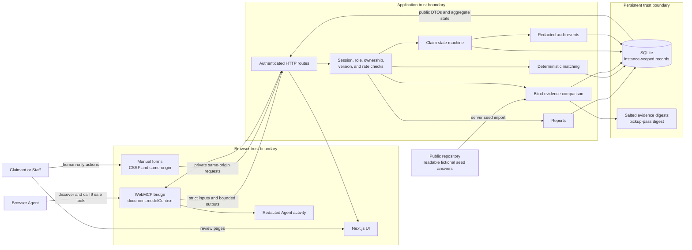

# ClaimGate architecture and trust boundaries

## Scope

ClaimGate is a single-instance competition demo for a campus lost-property desk. It combines a normal web application with nine native WebMCP tools. The tools help a browser Agent prepare public data and read bounded state. Sensitive transitions stay in manual HTML forms.

The demo is designed for fictional, non-identifying inputs. Its free-text
`publicDescription` fields are persisted, so this is an operating rule rather
than a claim that the application can prevent someone from entering real data.
ClaimGate does not implement production identity proofing, messaging, payments,
logistics, or a multi-tenant property network.

## System map

The WebMCP bridge does not contain a second copy of the business rules. It calls the same authenticated HTTP and domain services used by the normal UI.

## Runtime boundaries

| Boundary | What crosses it | What does not cross it |
| --- | --- | --- |
| Agent to WebMCP | Strict JSON tool inputs, public descriptors, opaque public resource IDs | CSRF tokens, session cookies, private evidence, internal inventory IDs, pickup credentials |
| Browser to server | Same-origin requests, signed HttpOnly demo session, action-bound CSRF data | Caller-selected user identity or demo instance ownership |
| Matching to Agent | Up to three candidates, confidence bands, broad fields, public reasons | Exact hidden attributes, raw score internals, private evidence |
| Evidence form to server | Manually entered fictional evidence over the private form path | A WebMCP tool input or Agent activity entry |
| Server to SQLite | Instance-scoped state, public free text, salted digests, versions, idempotency records, redacted audit events | Raw evidence after comparison, full pickup pass |
| Claimant UI to Staff | A manually transferred one-time credential | The credential in a URL, WebMCP result, server-rendered HTML, or audit log |

Every new browser demo session receives a separate `demoInstanceId` and a cloned fictional inventory. Composite database keys and repository checks keep instances separate. The signed session fixes the role and instance on the server. A role-switch control selects one of the two fictional identities for the same instance; it is a demo affordance, not production authentication.

There is no dedicated contact field. Public descriptions are user-controlled
text and persist in SQLite. Demo operators must use only fictional,
non-identifying descriptions.

## Native WebMCP lifecycle

The provider resolves `document.modelContext`, creates the current tools, and registers each one with `registerTool(tool, { signal })`. A new page or state generation aborts the previous controller. Server authorization and state checks remain authoritative even if an old tool call races with teardown.

| Page and state | Registered tools |
| --- | --- |
| Home or unsupported scope | none |
| Claimant workspace | `create_lost_report_draft`, `list_my_reports` |
| Claimant report, `DRAFT` | `update_lost_report_draft`, `list_my_reports` |
| Claimant report, `PUBLISHED` | `find_candidate_matches`, `list_my_reports` |
| Published report with current candidates | previous two plus `stage_claim_candidate` |
| Claimant claim, `EVIDENCE_REQUIRED`, `UNDER_REVIEW`, `LOCKED`, or `REJECTED` | `get_claim_status` |
| Claimant claim, `APPROVED` or `PICKUP_READY` | `get_claim_status`, `get_pickup_instructions` |
| Claimant claim, `COLLECTED` | `get_claim_status` |
| Staff queue | `list_pending_claims` |
| Staff claim, `UNDER_REVIEW`, `APPROVED`, or `PICKUP_READY` | `get_claim_status`, `get_claim_review_summary` |
| Staff claim, `EVIDENCE_REQUIRED`, `LOCKED`, `REJECTED`, or `COLLECTED` | `get_claim_status` |

### Tool contract

All nine tools have strict object schemas with extra properties rejected. Read tools declare `readOnlyHint`. Results containing public user text declare `untrustedContentHint`. Outputs pass a per-tool schema and a 1,500-character JSON cap before reaching the Agent. Failures use canonical, bounded error messages.

Write tools use expected versions or idempotency keys where the operation needs them. A candidate is represented by a signed opaque handle bound to the demo instance, report, report version, inventory catalog version, and a short expiry. A handle becomes invalid after relevant state changes.

## Human-only actions

These transitions are not present in the nine-tool registry:

| Action | Manual boundary | Consequence |
| --- | --- | --- |
| Publish or archive a report | Claimant form | Makes a report searchable or closes it when allowed |
| Submit private evidence | Password-style Claimant form | Produces only aggregate eligibility or insufficiency |
| Approve, reject, or unlock | Staff form | Applies the staff decision or the one allowed unlock |
| Issue or reissue pickup pass | Claimant form | Creates one short-lived credential and invalidates an older generation |
| Complete handoff | Staff credential form | Atomically closes the claim, item, and report |
| Switch demo role | Explicit demo form | Changes only the fixed fictional role in the same instance |

This boundary proves that the WebMCP Agent has no structured tool for these actions. It does not claim to stop a separate automation product with general computer-control access from clicking the forms.

## Deterministic matching and private proof

Matching uses public fields only:

- category is an exact gate;
- time overlap or distance contributes a fixed score;
- campus area and predefined adjacency contribute a fixed score;
- normalized color and public tags contribute fixed scores;
- candidates below 50 are omitted, and only the top three remain;
- confidence is `strong` at 75 or above, `possible` from 60 to 74, and `weak` from 50 to 59.

Private evidence uses three slots: a unique mark, an accessory or contents detail, and an identifier suffix. The server normalizes each value with Unicode NFKC, lowercase, trimmed and collapsed whitespace, and normalized hyphens. It compares an HMAC digest that also binds the demo instance, item, slot, and an independent salt.

Eligibility is a pure two-of-three count. Two correct slots are sufficient even
when the third submitted slot is wrong. The verifier keeps a fixed three-slot
comparison shape, and the browser never receives a per-field result or correct
count. Attempts one and two can return aggregate `INSUFFICIENT_EVIDENCE`; the
third insufficient attempt returns aggregate `LOCKED`. One manual Staff unlock
resets the attempt count.

The fictional answers used to seed the demo are readable in
`src/server/db/private-evidence-seed.ts` in the public repository. At instance
creation the server stores salted digests, not the raw answers, in SQLite. The
runtime privacy boundary covers client bundles, rendered pages, API and WebMCP
results, Agent activity, logs, and stored raw evidence. It does not protect the
fictional seed answers from a repository reader.

## Claim integrity

- State-changing requests carry expected versions, action-specific rate limits, and idempotency data where required.
- Approval holds the item and rejects competing pending claims in one transaction.
- Pickup-pass issue and reissue are idempotent and generation-bound.
- Only a successful issue or reissue response returns the full pass. The
  Claimant page keeps it in memory and can reveal, mask, or copy it. Navigation
  or refresh clears it and cannot recover it.
- The pass is valid for ten minutes, stored as a digest, and accepted once.
- Handoff updates the Claim to `COLLECTED`, the FoundItem to `RETURNED`, and the LostReport to `RESOLVED` in one transaction. Any failed write rolls back all three.
- Audit events record actor type, action, result, and time without private evidence or credentials.

## Threat model

| Threat | Control | Residual boundary |
| --- | --- | --- |
| Another demo user reads or mutates a resource | Signed session, instance-scoped composite keys, ownership checks | The fixed roles are for a demo, not real identity proofing |
| A claimant guesses hidden attributes | Public-only candidate output, blind comparison, aggregate result, three-attempt lock | Staff still makes the ownership decision |
| Malicious public text instructs the Agent | Strict tool selection, untrusted-content annotations, escaped UI, bounded schemas | WebMCP cannot control every behavior of a general browser Agent |
| A stale page or tool repeats a write | Abort-driven tool generations, server state/version checks, idempotency | Aborting registration is not used as an authorization control |
| Two claims race for one item | SQLite transactions, optimistic versions, one approved/ready claim invariant | The deployment is single-instance SQLite |
| Pickup credential leaks or replays | Issue/reissue-only response, current-page memory, reveal/mask/copy controls, digest-only storage, expiry, generation invalidation | The Claimant must still transfer the credential to Staff before leaving or refreshing |
| Runtime evidence or session data enters client artifacts | Server-only import boundary, output allowlists, build scans, no public source maps | The public repository still exposes the fictional seed answers by design |
| Real identifying text is entered in a demo | Clear operating instructions and no dedicated contact field | Free-text public descriptions are persisted; the application cannot enforce fictional content |
| Demo-start abuse consumes resources | Application limits plus a restart-safe ingress rolling-window gate | Shared network addresses can share a quota |

## Deployment boundary

The release design uses a dedicated system account, immutable application and Node.js release directories, a loopback-only listener, separate state directories, two ClaimGate-only systemd units, and a dedicated Nginx SNI vhost. Certificate issuance uses an isolated ACME webroot. Deployment procedures do not stop, rename, or reuse an existing service, listener, certificate, VPN, or proxy.

The detailed runbook is [deployment.md](deployment.md). It describes the intended production setup and verification gates. It is not evidence that the public deployment is already live.

## Verification evidence

The current checked evidence proves:

- portable lint, type, unit, integration, build, and secret-surface gates;
- production Playwright workflows;
- Linux-native release and deployment integration checks;
- three independent native Chrome 151 runs against one clean production build;
- all 14 visible Playwright E2E scenarios after the `04c618d` cross-role
  navigation change;
- all nine tools executed in each native run;
- human-only tool names absent in every phase;
- `getTools()` empty after returning home;
- fresh SQLite state and cleanup for every run.

See [testing.md](testing.md) for the native run matrix and SHA-256 evidence. That file explicitly records a local production-standalone test. Public HTTPS and in-app-browser deployment checks remain separate gates until their current evidence is recorded.

## Primary implementation locations

| Concern | Location |
| --- | --- |
| Tool definitions and schemas | `src/features/webmcp/tool-factory.ts`, `tool-input-schemas.ts`, `tool-output-schemas.ts` |
| Page and state selection | `src/features/webmcp/tool-registry.ts` |
| Native registration lifecycle | `src/features/webmcp/tool-registration.ts`, `src/components/webmcp-provider.tsx` |
| Matching rules | `src/features/matching/score-candidate.ts`, `match-service.ts` |
| Evidence boundary | `src/features/evidence`, `src/server/db/evidence-repository.ts` |
| Claim and pass lifecycle | `src/features/claims`, `src/server/db/pickup-pass-repository.ts` |
| Authenticated HTTP boundary | `src/server/http`, `src/app/api` |
| Persistence and migrations | `src/server/db` |
| Native acceptance | `scripts/run-native-acceptance.ts`, `scripts/verify-native-webmcp.ts` |
